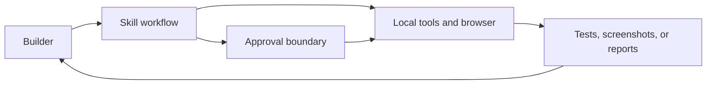

# RStack

**Status:** experimental agentic-engineering toolkit

RStack packages product discovery, engineering review, browser QA, security, release, and learning workflows for AI coding agents. It is designed around explicit authority, reusable skills, and evidence-producing checks rather than autonomous production access.

## Provenance and contribution

RStack is derived from Garry Tan's **gstack** and keeps its MIT license, copyright, directory conventions, and compatibility identifiers. Most core workflows originate upstream.

This portfolio edition's clearly identified additions are:

- **Scrapling integration:** bounded public-web extraction without vendoring the Scrapling runtime.
- **Agent Reach integration:** routing for research across currently available internet backends.
- Raghav-specific documentation and operating defaults around reuse, authority, and evidence.

No claim is made that inherited gstack work was authored here. The preserved detailed guide is in [docs/PROJECT_GUIDE.md](docs/PROJECT_GUIDE.md).

## How it fits together



## Quick start

Requirements: Git, Bun 1+, and a supported coding-agent host.

```bash
git clone --single-branch --depth 1 https://github.com/raghavbadhwar/rstack.git
cd rstack
./setup --host codex
```

Use `./setup --host <name>` for another supported host. Review the setup script before installation because it writes skills into user-level agent directories.

## Checks

```bash
bun install --frozen-lockfile
bun run build
bun test
```

Network/model-backed evaluation suites are separate and are not implied by the local test command.

## Boundaries and limitations

- Skills can guide consequential operations, but they do not replace human authorization.
- Browser, deployment, and third-party integrations require separate local configuration.
- Compatibility depends on the installed agent host and external tools.
- This repository is a toolkit, not evidence of production deployment or customer use.

## License

MIT. See [LICENSE](LICENSE) for the preserved upstream notice.
